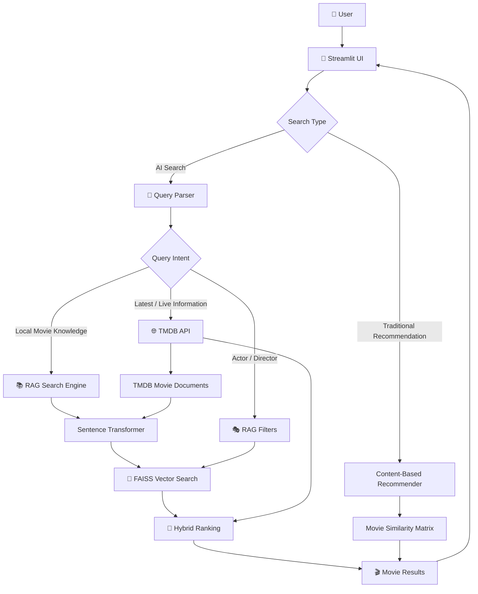

# 🎬 MovieVerse AI

### AI-Powered Movie Discovery & Recommendation System

[](https://movieverseai.streamlit.app/)
[](https://github.com/Ayushyuvisingh/Movie_Recommendation_System/releases/tag/v2.0.0)
[](https://www.python.org/)
[](https://streamlit.io/)
[](https://github.com/facebookresearch/faiss)

> **MovieVerse AI** is an AI-powered movie discovery and recommendation platform that combines traditional content-based recommendation, Retrieval-Augmented Generation (RAG), semantic search, FAISS vector retrieval, and live TMDB data to provide a more intelligent movie discovery experience.

🌐 **Live Demo:** https://movieverseai.streamlit.app/

---

## ✨ What is MovieVerse?

Traditional movie recommendation systems usually depend entirely on a fixed dataset.

**MovieVerse goes beyond that approach.**

It combines:

- 🎯 Traditional content-based recommendations
- 🧠 Semantic search using embeddings
- 🔎 FAISS vector retrieval
- 🤖 HybridRAG search
- 🌐 Live TMDB movie discovery
- 🎭 Actor and director-based queries
- 🆕 Latest movie discovery
- 🖼️ Dynamic movie posters and metadata
- ⚡ Cached model and data loading
- 📊 Real-time search progress feedback

This allows MovieVerse to work with both:

**Local movie knowledge**

and

**Live movie information**

instead of being restricted to a static movie dataset.

---

# 🚀 Key Features

## 🎯 1. Content-Based Movie Recommendation

The original recommendation engine uses a precomputed similarity matrix to recommend movies based on movie characteristics.

The system currently works with approximately **4,806 movies**.

---

## 🧠 2. HybridRAG Search

MovieVerse V2 introduces a HybridRAG architecture that combines multiple retrieval strategies.

Instead of relying on a single search method, the system can combine:

```text
User Query
    ↓
Query Understanding
    ↓
Local Retrieval + Semantic Retrieval
    ↓
TMDB Live Discovery (when required)
    ↓
Filtering & Ranking
    ↓
Final Results
```

This allows MovieVerse to understand more natural movie-related queries.

---

## 🔎 3. Semantic Search

Movie descriptions are converted into vector embeddings using a Sentence Transformer model.

These embeddings are indexed using FAISS.

```text
Movie Documents
      ↓
Sentence Transformer
      ↓
Embeddings
      ↓
FAISS Index
      ↓
Semantic Retrieval
```

This allows the system to search by meaning rather than relying only on exact keyword matching.

---

## 🌐 4. Live TMDB Movie Discovery

MovieVerse can retrieve current movie information through the TMDB API.

This helps overcome a major limitation of static recommendation datasets.

For example, if the local dataset does not contain the newest movie from an actor, MovieVerse can query TMDB for current information.

---

## 🎭 5. Actor & Director Queries

The AI search layer can interpret queries involving people associated with movies.

Examples:

```text
Movies starring Yash

Movies directed by Christopher Nolan

Latest movie of Yash
```

The query parser determines the intent and routes the request through the appropriate retrieval pipeline.

---

## 🆕 6. Latest Movie Discovery

MovieVerse can combine local movie knowledge with live TMDB data to find newer releases.

This makes the system more useful than a recommendation engine based only on an old static dataset.

---

## 🖼️ 7. Dynamic Movie Information

Search results can include:

- Movie title
- Poster
- Rating
- Release information
- Overview
- Additional movie metadata

Poster information can also be enriched using the local movie catalog when required.

---

## ⚡ 8. Search Progress Feedback

HybridRAG searches may involve multiple retrieval stages.

MovieVerse provides progress feedback during longer searches so users can see what the system is doing instead of waiting on a blank screen.

---

# 🏗️ System Architecture



---

# 🧠 HybridRAG Architecture

The core AI search pipeline can be represented as:

```text
                    USER QUERY
                        │
                        ▼
                ┌─────────────────┐
                │   Query Parser  │
                └────────┬────────┘
                         │
              ┌──────────┼──────────┐
              │          │          │
              ▼          ▼          ▼
           General     Person      Latest/
           Search      Search      Live Search
              │          │          │
              ▼          ▼          ▼
          Local RAG   RAG Filters   TMDB API
              │          │          │
              └──────────┼──────────┘
                         ▼
                 Sentence Transformer
                         │
                         ▼
                    FAISS Search
                         │
                         ▼
                  Hybrid Ranking
                         │
                         ▼
                  Final Results
```

---

# 📦 Data & Retrieval Layer

MovieVerse uses several data components:

| Component | Purpose |
|---|---|
| `movie_dict.pkl` | Original movie dataset |
| `similarity.pkl` | Precomputed movie similarity matrix |
| `movie_catalog.csv` | Movie metadata/catalog |
| `movie_documents.jsonl` | Documents used for RAG |
| `movie_embeddings.npy` | Precomputed vector embeddings |
| `movie_index.faiss` | FAISS vector index |

Large model/data files are managed using **Git LFS**.

---

# 🛠️ Technology Stack

### Frontend

- Streamlit

### Programming Language

- Python 3.12

### Machine Learning / NLP

- Sentence Transformers
- PyTorch
- Scikit-learn

### Retrieval

- FAISS
- Vector embeddings
- Semantic search
- Hybrid retrieval

### Movie Data

- TMDB API
- Local movie catalog

### Data Processing

- Pandas
- NumPy
- Pickle

### Deployment

- Streamlit Community Cloud

### Version Control

- Git
- GitHub
- Git LFS

---

# 📁 Project Structure

```text
Movie_Recommendation_System/
│
├── app.py
├── requirements.txt
├── README.md
├── .gitignore
│
├── data/
│   ├── movie_dict.pkl
│   ├── similarity.pkl
│   ├── movie_catalog.csv
│   ├── movie_documents.jsonl
│   ├── movie_embeddings.npy
│   └── movie_index.faiss
│
├── pages/
│   └── movie.py
│
├── src/
│   ├── __init__.py
│   ├── recommender.py
│   ├── hybrid_rag.py
│   ├── query_parser.py
│   ├── rag_filters.py
│   ├── rag_search.py
│   ├── tmdb.py
│   ├── tmdb_documents.py
│   ├── tmdb_embeddings.py
│   └── tmdb_rag.py
│
├── scripts/
│   ├── build_movie_catalog.py
│   ├── build_rag_documents.py
│   ├── build_embeddings.py
│   ├── build_faiss_index.py
│   └── test_*.py
│
└── .streamlit/
```

---

# 🔄 How a Movie AI Search Works

For a query such as:

```text
latest movie of Yash
```

MovieVerse follows a pipeline similar to:

```text
User Query
    ↓
Query Parser
    ↓
Detect person + latest intent
    ↓
TMDB discovery
    ↓
Retrieve candidate movies
    ↓
Create/retrieve relevant embeddings
    ↓
Semantic + metadata filtering
    ↓
Hybrid ranking
    ↓
Movie cards
    ↓
User
```

For a local semantic query:

```text
movies similar to a dark psychological thriller
```

the system can use:

```text
Query
  ↓
Sentence Transformer
  ↓
Query Embedding
  ↓
FAISS
  ↓
Nearest Movie Documents
  ↓
Ranking / Filtering
  ↓
Results
```

---

# ⚙️ Local Setup

## 1. Clone the repository

```bash
git clone https://github.com/Ayushyuvisingh/Movie_Recommendation_System.git

cd Movie_Recommendation_System
```

## 2. Create a virtual environment

### Windows

```bash
python -m venv venv

venv\Scripts\activate
```

### Linux / macOS

```bash
python3 -m venv venv

source venv/bin/activate
```

## 3. Install dependencies

```bash
pip install -r requirements.txt
```

## 4. Configure TMDB API key

Create:

```text
.streamlit/secrets.toml
```

and add:

```toml
TMDB_API_KEY = "YOUR_TMDB_API_KEY"
```

**Do not commit your API key.**

## 5. Run MovieVerse

```bash
streamlit run app.py
```

The application will be available at:

```text
http://localhost:8501
```

---

# 🔐 Security

API credentials are intentionally excluded from the repository.

For local development:

```text
.streamlit/secrets.toml
```

is used.

For Streamlit Community Cloud, secrets are configured through the platform's secret management system.

Never commit API keys or other credentials to GitHub.

---

# ☁️ Deployment

MovieVerse is currently deployed using:

**Streamlit Community Cloud**

### Live Application

🌐 **https://movieverseai.streamlit.app/**

The deployment uses:

```text
GitHub
   ↓
Streamlit Community Cloud
   ↓
Python 3.12
   ↓
requirements.txt
   ↓
MovieVerse
```

The application uses the same Python version as the tested local environment.

---

# 🏷️ Version

## v2.0.0 — HybridRAG & AI Search

Major V2 upgrade introducing:

- HybridRAG
- Semantic search
- FAISS vector retrieval
- Sentence Transformer embeddings
- Query parsing
- Actor/director search
- Latest movie discovery
- TMDB live integration
- AI movie result cards
- Search progress feedback

Git tag:

```text
v2.0.0
```

---

# 🔮 Future Improvements

Planned improvements for future versions include:

- Exact-title intelligent lookup
- Unified search experience
- Further search latency optimization
- Improved ranking and reranking
- Conversation-aware movie discovery
- Personalized recommendations
- User preference profiles
- Watchlist and favorites
- More advanced RAG evaluation
- Production-oriented backend architecture

---

# 📊 Current Project Scale

MovieVerse V2 currently includes approximately:

```text
4,806 movies
6+ data/index files
FAISS vector retrieval
Sentence Transformer embeddings
TMDB live discovery
HybridRAG search
Content-based recommendation
```

---

# 👨‍💻 Author

## Ayush Kumar

**B.Tech — Computer Science & Engineering (AIML)**

Interested in:

- Machine Learning
- Generative AI
- Retrieval-Augmented Generation
- AI Engineering
- Backend Development

---

# ⭐ Project

If you find MovieVerse interesting, consider starring the repository.

### GitHub

https://github.com/Ayushyuvisingh/Movie_Recommendation_System

### Live Demo

https://movieverseai.streamlit.app/
